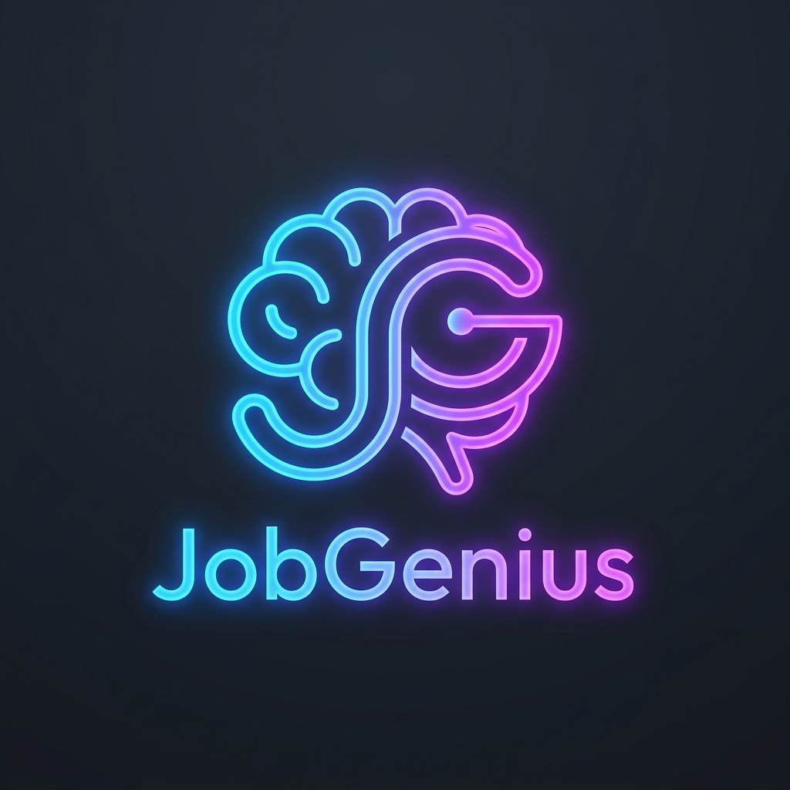

# JobGenius - AI-Powered Career Intelligence 🚀

JobGenius is a sophisticated, AI-driven career intelligence platform that helps professionals optimize their resumes and discover the best-fitting job opportunities. By leveraging **Google Gemini AI** and **Semantic Vector Search**, JobGenius provides deep technical insights, actionable career advice, and hyper-relevant job matches from live sources.



## 🌟 Key Features

- **🧠 AI Resume Analysis**: Uses advanced NLP (Spacy) and Gemini Pro to extract technical skills, evaluate career compatibility, and provide a professional sentiment score.
- **💡 AI Career Advisor**: Generates 5-6 strategic, highly specific technical suggestions using Google Gemini to enhance your professional impact and bridge skill gaps.
- **🔍 Smart Job Matching**: Employs **ChromaDB** and **Sentence Transformers** (`all-MiniLM-L6-v2`) to perform semantic searches against live job listings from LinkedIn, Google Jobs, and more.
- **📊 Interactive Dashboard**: A persistent, user-friendly dashboard that tracks your resume analysis, career suggestions, and job recommendations over time.
- **🌐 Live Job Discovery**: Integrated with `python-jobspy` to fetch real-time job postings tailored to your profile and location (optimized for the Indian market).
- **🎨 Modern UI/UX**: Built with React 19 and Vite, featuring a sleek "Glassmorphism" design with neon themes and fully responsive layouts.

## 🛠️ Technology Stack

### **Backend (Django)**
- **Framework**: Django 6.0.3 & Django REST Framework (DRF)
- **AI Engine**: Google Gemini Pro (2.5-flash / 1.5-pro)
- **Vector DB**: ChromaDB (Persistent vector storage)
- **NLP & ML**: Spacy, Sentence-Transformers, Scikit-learn
- **Document Processing**: PyPDF2, python-docx
- **Job Discovery**: python-jobspy (Live scraping from LinkedIn/Google)
- **Database**: SQLite (Development) / PostgreSQL (Production ready)

### **Frontend (React)**
- **Framework**: React 19 with Vite
- **Routing**: React Router 7
- **Styling**: Modern CSS with Glassmorphism, CSS Variables, and Flex/Grid layouts.
- **Icons**: Custom SVG icons and Lucide-inspired components.

## 📦 Installation & Local Setup

### **Prerequisites**
- Python 3.10+
- Node.js 18+
- [Google Gemini API Key](https://aistudio.google.com/app/apikey)

### **1. Backend Setup**
```bash
cd backend

# Create and activate virtual environment
python -m venv venv
# On Windows:
venv\Scripts\activate
# On macOS/Linux:
source venv/bin/activate

# Install dependencies
pip install -r requirements.txt

# Create a .env file in the backend directory
# Add the following line:
# GEMINI_API_KEY=your_gemini_api_key_here

# Run migrations and start server
python manage.py migrate
python manage.py runserver
```

### **2. Frontend Setup**
```bash
cd frontend

# Install dependencies
npm install

# Start development server
npm run dev
```
The application will be available at `http://localhost:5173`.

## 🔌 API Reference & Testing

JobGenius provides a comprehensive RESTful API. A Postman collection is included in the root directory for easy testing.

### **Postman Collection**
1. **Import**: Open Postman and import `JobGenius_Postman_Collection.json`.
2. **Setup**: The collection uses `base_url` (default: `http://localhost:8000`).
3. **Workflow**:
   - **Login** (`/api/token/`) to receive a JWT token. The collection is pre-configured to save this token.
   - **Upload Resume** (`/api/resume/upload/`) to process your CV.
   - **Get Suggestions** (`/api/suggestions/suggestions/<id>/`) for AI career advice.
   - **Get Job Matches** (`/api/jobs/recommend/<id>/`) for AI-matched job listings.

### **Key Endpoints**
| Endpoint | Method | Description |
| :--- | :--- | :--- |
| `/api/token/` | `POST` | User login & JWT token generation |
| `/api/resume/register/` | `POST` | Create a new user account |
| `/api/resume/upload/` | `POST` | Upload PDF/DOCX for AI analysis |
| `/api/resume/my-resume/` | `GET` | Retrieve latest resume analysis |
| `/api/suggestions/suggestions/<id>/` | `GET` | Get personalized AI career tips |
| `/api/jobs/recommend/<id>/` | `GET` | Get semantic-matched live jobs |

## 🚀 How It Works

1. **Upload**: Users upload their resume in PDF or DOCX format.
2. **Parse & Analyze**: The backend extracts text using PyPDF2/python-docx and identifies skills using Spacy.
3. **AI Scoring**: Gemini AI evaluates the resume's technical depth, sentiment, and career alignment.
4. **Vectorization**: The processed profile is converted into a vector embedding.
5. **Matching**: JobSpy fetches live jobs, which are then ranked against the user's profile using ChromaDB's cosine similarity.
6. **Insight**: The user receives a detailed dashboard with suggestions and relevant job links.


